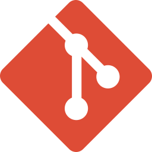

# Hi, I'm Daksh P. Jain

## About Me
- I'm a beginner programmer and a student from New Delhi, India.
- I know HTML, CSS, very little JavaScript and I'm currently learning Python. I also have knowledge about Android development (Custom ROMs, rooting, theming, etc.)
- I'm also a passionate photographer (or mobile photographer) and I usually take photos of still scenes and animals.- 
- I love the English language and my CEFR level is C1.
- I also love listening to music with my favorite genres being [German](https://open.spotify.com/playlist/2I6QOUXFekJHdaOSd0u50g?si=e456900b954b49ba) and [Romanian pop](https://open.spotify.com/playlist/0O1PytZfZvI8VzAO7yod07?si=E_0_dmYQTZOh2UP1V7LBAA).

## Projects & Contributions
- Windows 10 Debloat, a collection of Powershell scripts, apps, and registry scripts to improve Windows 10 performance, security and optimisations: [Daksh777/windows10-debloat](https://github.com/Daksh777/windows10-debloat)
- My website: [Daksh777/website](https://github.com/Daksh777/website)
- My old website: [Daksh777/old-website](https://github.com/Daksh777/old-website)
- Contributor to Retro Music Player: [h4h13/RetroMusicPlayer](https://github.com/h4h13/RetroMusicPlayer)
- Antispam bot, a Telegram bot which blocks t.me/joinchat links: [Daksh777/antispambot](https://github.com/Daksh777/antispambot)
- SpotifyNoPremium, a modified Spotify stock theme that removes Spotify's clutter using Spicetify CLI: [Daksh777/SpotifyNoPremium](https://github.com/Daksh777/SpotifyNoPremium)

## Software & Technologies
</img>
</img>
</img>
</img>
</img>
</img>
</img>
</img>
</img>
</img>
</img>
</img>
</img>
</img>
 
 
## Find Me:

 

---

