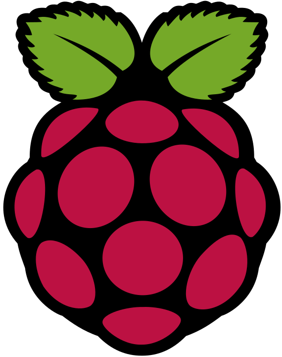

# Hi, I'm Daksh P. Jain

## About Me
- I'm a beginner programmer and a student from New Delhi, India.
- I know HTML, CSS, very little JavaScript and I'm currently learning Python. I also have knowledge about Android development (Custom ROMs, rooting, theming, etc.)
- I'm also a passionate photographer (or mobile photographer) and I usually take photos of still scenes and animals.- 
- I love the English language and my CEFR level is C1. I'm also learning German currently.
- I also love listening to music with my favorite genres being [German](https://open.spotify.com/playlist/2I6QOUXFekJHdaOSd0u50g?si=e456900b954b49ba) and [Romanian pop](https://open.spotify.com/playlist/0O1PytZfZvI8VzAO7yod07?si=E_0_dmYQTZOh2UP1V7LBAA).

## Projects & Contributions
- Windows 10 Debloat, a collection of Powershell scripts, apps, and registry scripts to improve Windows 10 performance, security and optimisations: [Daksh777/windows10-debloat](https://github.com/Daksh777/windows10-debloat)
- My website: [Daksh777/website](https://github.com/Daksh777/website)
- My old website: [Daksh777/old-website](https://github.com/Daksh777/old-website)
- Contributor to Retro Music Player: [h4h13/RetroMusicPlayer](https://github.com/h4h13/RetroMusicPlayer)
- Antispam bot, a Telegram bot which blocks t.me/joinchat links: [Daksh777/antispambot](https://github.com/Daksh777/antispambot)
- SpotifyNoPremium, a modified Spotify stock theme that removes Spotify's clutter using Spicetify CLI: [Daksh777/SpotifyNoPremium](https://github.com/Daksh777/SpotifyNoPremium)

## Software & Technologies

 

## Find Me

[![Website](https://img.shields.io/badge/WEBSITE-E34F26?style=for-the-badge&logo=data:image/png;base64,iVBORw0KGgoAAAANSUhEUgAAABgAAAAYCAYAAADgdz34AAAABGdBTUEAALGPC/xhBQAAACBjSFJNAAB6JgAAgIQAAPoAAACA6AAAdTAAAOpgAAA6mAAAF3CculE8AAAABmJLR0QAAAAAAAD5Q7t/AAAACXBIWXMAAABgAAAAYADwa0LPAAABt0lEQVRIx9WVv04UURjFz2yCD0CgIECBFVIur0DIUu26Cb6BNpoVe01sF58BGhIKaZZS3wEqQCLrgmZjo6EUhcQfxZ6JH8tldzA0nOTmmzn33PPN/feNdN+RDeoEHkiqSqpJKkuadldX0q6klqRWlmXnt84M1IE2w9EG6rcxLgGrwWAP+ObnD24AJ8BB0L0DSkUSND3gF/AcmAb+AOfALPDIz7+BKaABnHnM6jDzx8F8wdxbc++DbsvcG78vhiS1m8xHgCOLXgQ+X4ZK4CrmdgPXMNfx4biW4EmBDS2K5dw3bkp6av+HamoGn529HLhn5tYS+nX3PQ1c2dxhagYTjp3AjTr+THzljz6NJB07TqYSpIBj6sZnfZqIv6kE3x0fBu7UcSxhMt6nkaSZPq8ra7p5h6doIzWDlu4O26kZxIvWCPx+4qItmdsJ3Iq5L8mLZlHdojNg0VxeKraCLi8Vr/1eoVebAKoaBHpVMU/ykqvFbs7twoaTwKtg3hy6eFwv15/4V64/ugF8BQ6DrkmRch0S1cKeDMLRoGUZ9sscUa9GVSXNS5pyV1fSjnonbzvLsovCX37vcAknHfpX/fQzSwAAACV0RVh0ZGF0ZTpjcmVhdGUAMjAyMS0wNy0wOFQxMjo0MTo0MSswMDowMKLsX/kAAAAldEVYdGRhdGU6bW9kaWZ5ADIwMjEtMDctMDhUMTI6NDE6NDErMDA6MDDTsedFAAAAAElFTkSuQmCC&logoColor=white)](https://daksh.eu.org)

 

---

  
 GitHub Stats 

